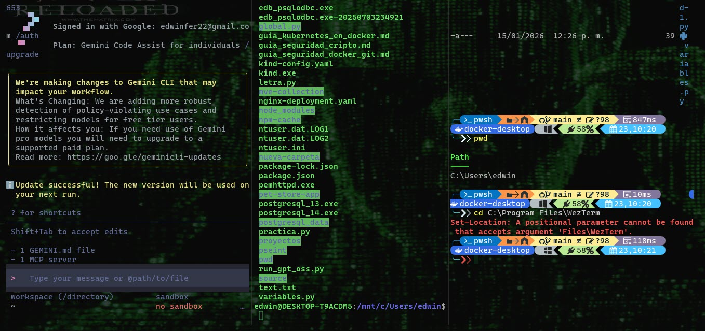

# Mi Terminal Pro (Estilo Matrix) 🚀

Haz clic derecho sobre el archivo README.md -> Edit with Notepad++.
Borra lo que haya y pega este diseño (puedes cambiar lo que quieras):

# 💻 Mi Terminal Pro (Estilo Matrix)

¡Bienvenido a mi configuración personalizada de terminal! He convertido mi PowerShell en una herramienta de "hacker" ultra
     rápida y fluida.

## ✨ Características:
*   **Terminal:** WezTerm (Acelerada por GPU).
*   **Motor:** PowerShell 7 (La versión Pro).
*   **Estilo:** "The Matrix" (Letras verdes y parpadeantes).
*   **Fondo:** Imagen personalizada de Neo / Código Matrix.
*   **Funciones:** Pantalla dividida, pestañas modernas y sin avisos al cerrar.

 ## ⌨️ Mis Atajos Rápidos:
 *   `Alt + H`: Dividir pantalla horizontalmente.
 *   `Alt + V`: Dividir pantalla verticalmente.
 *   `Alt + W`: Cerrar el panel actual (¡Rápido!).
 *   `Alt + Flechas`: Moverse entre paneles.

 ## 🚀 Cómo instalarla:
. Instala WezTerm con `winget install wez.wezterm`.
. Copia mi archivo `.wezterm.lua` en tu carpeta de usuario.
. ¡Disfruta de la velocidad!